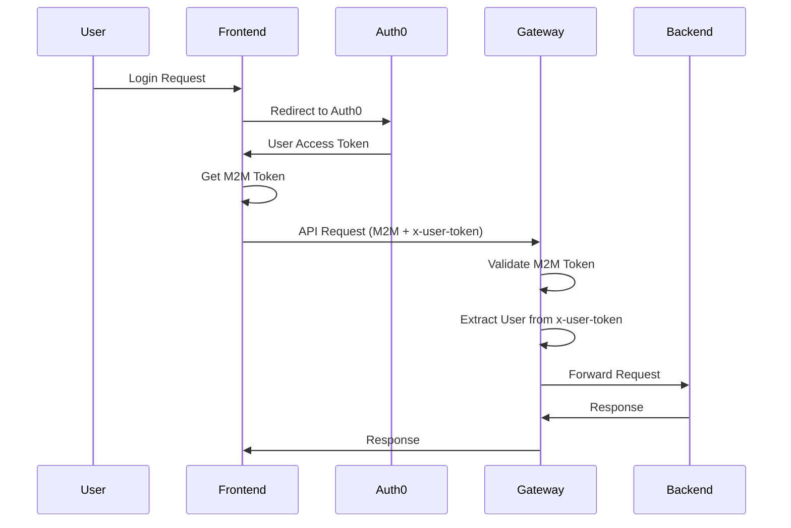
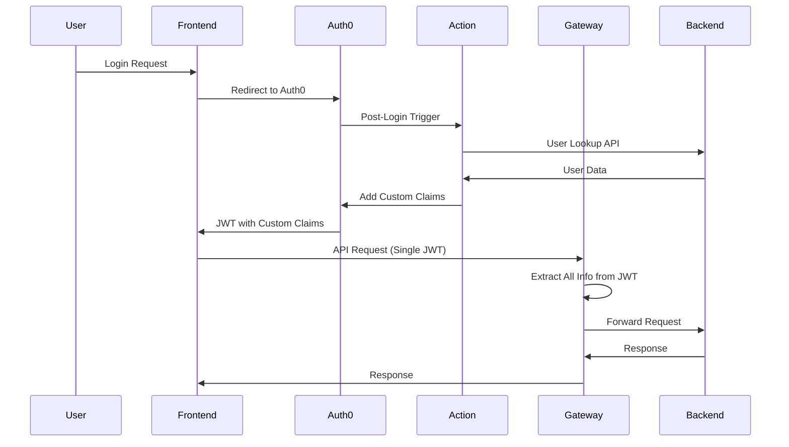

# Architecture Comparison: Current vs Target Authentication

## Overview

This document provides a detailed comparison between the current M2M + x-user-token authentication architecture and the target JWT with Custom Claims architecture.

## Current Architecture (M2M + x-user-token)

### Authentication Flow Diagram


### Current Implementation Details

#### Frontend (useAuth.ts)
```typescript
// Current: Dual token management
const getToken = async () => {
  if (authContext.user) {
    return await authContext.getM2MToken(); // M2M token
  } else {
    return await auth0.getAccessTokenSilently(); // User token
  }
};

const authFetch = async (url: string, options: RequestInit = {}) => {
  const token = await getToken();
  const headers = {
    ...options.headers,
    Authorization: `Bearer ${token}`, // M2M token
  };
  
  // Add user context header
  if (authContext.user) {
    const userToken = localStorage.getItem('access_token');
    if (userToken) {
      headers['x-user-token'] = userToken; // User context
    }
  }
  
  return fetch(url, { ...options, headers });
};
```

#### Backend (unifiedAuth.js)
```javascript
// Current: Complex dual token validation
const unifiedAuth = (options = {}) => {
  return async (req, res, next) => {
    const authHeader = req.headers.authorization;
    const userTokenHeader = req.headers['x-user-token'];
    
    // Validate M2M token
    if (authHeader) {
      const token = authHeader.replace('Bearer ', '');
      const decoded = jwt.verify(token, secret);
      req.serviceAuth = decoded;
    }
    
    // Extract user context from x-user-token
    if (userTokenHeader && options.requireUser) {
      const userProfile = await getUserProfile(userTokenHeader);
      req.user = userProfile;
    }
    
    next();
  };
};
```

### Current Architecture Issues

1. **Token Management Complexity**
   - Frontend manages two token types
   - Complex token refresh logic
   - Multiple failure points

2. **Non-Standard Headers**
   - x-user-token is not industry standard
   - Custom header validation logic
   - Debugging difficulties

3. **Security Concerns**
   - User context not cryptographically verified
   - Separate validation processes
   - Complex authorization flows

4. **Maintenance Burden**
   - Multiple authentication paths
   - Complex error handling
   - Difficult to troubleshoot

## Target Architecture (JWT with Custom Claims)

### Authentication Flow Diagram


### Target Implementation Details

#### Auth0 Action
```javascript
// Target: Embed user info in JWT
exports.onExecutePostLogin = async (event, api) => {
  const namespace = 'https://short-video-creator.com/';
  
  // Get user data from backend
  const response = await fetch(`${event.secrets.BACKEND_URL}/api/auth/user-lookup`, {
    method: 'POST',
    headers: {
      'Content-Type': 'application/json',
      'Authorization': `Bearer ${event.secrets.BACKEND_M2M_TOKEN}`
    },
    body: JSON.stringify({
      auth0_id: event.user.user_id,
      email: event.user.email,
      name: event.user.name,
      picture: event.user.picture
    })
  });
  
  if (response.ok) {
    const userData = await response.json();
    
    // Embed all user info in JWT
    api.accessToken.setCustomClaim(`${namespace}user_id`, userData.user_id);
    api.accessToken.setCustomClaim(`${namespace}email`, userData.email);
    api.accessToken.setCustomClaim(`${namespace}name`, userData.name);
    api.accessToken.setCustomClaim(`${namespace}picture`, userData.picture);
    api.accessToken.setCustomClaim(`${namespace}provider`, userData.provider);
    api.accessToken.setCustomClaim(`${namespace}is_admin`, userData.is_admin || false);
    api.accessToken.setCustomClaim(`${namespace}permissions`, userData.permissions || []);
  }
};
```

#### Frontend (useAuth.ts)
```typescript
// Target: Single token management
const getToken = async () => {
  // Always use user token with embedded claims
  return await auth0.getAccessTokenSilently();
};

const authFetch = async (url: string, options: RequestInit = {}) => {
  const token = await getToken();
  const headers = {
    ...options.headers,
    Authorization: `Bearer ${token}`, // Single JWT with claims
  };
  
  // No need for x-user-token header anymore
  
  return fetch(url, { ...options, headers });
};
```

#### Backend (unifiedAuth.js)
```javascript
// Target: Single token validation with custom claims
const unifiedAuth = (options = {}) => {
  return async (req, res, next) => {
    const authHeader = req.headers.authorization;
    
    if (authHeader) {
      const token = authHeader.replace('Bearer ', '');
      const decoded = jwt.verify(token, secret);
      
      // Extract custom claims
      const namespace = 'https://short-video-creator.com/';
      const userClaims = {
        userId: decoded[`${namespace}user_id`],
        email: decoded[`${namespace}email`],
        name: decoded[`${namespace}name`],
        picture: decoded[`${namespace}picture`],
        provider: decoded[`${namespace}provider`],
        isAdmin: decoded[`${namespace}is_admin`] || false,
        permissions: decoded[`${namespace}permissions`] || []
      };
      
      // Set both service and user context from single token
      req.serviceAuth = decoded;
      req.user = userClaims;
    }
    
    next();
  };
};
```

## Comparison Matrix

| Aspect | Current (M2M + x-user-token) | Target (JWT Custom Claims) |
|--------|------------------------------|----------------------------|
| **Token Count** | 2 tokens (M2M + User) | 1 token (JWT with claims) |
| **Headers** | `Authorization` + `x-user-token` | `Authorization` only |
| **Validation** | Dual validation logic | Single JWT validation |
| **Security** | User context not verified | Cryptographically verified |
| **Standards** | Custom implementation | Industry standard |
| **Complexity** | High | Low |
| **Maintainability** | Difficult | Easy |
| **Performance** | Multiple validations | Single validation |
| **Debugging** | Complex | Simple |

## Migration Impact Analysis

### Services Affected

#### High Impact (Major Changes Required)
- ✅ **Frontend Authentication Hooks** - Complete refactor of token management
- ✅ **API Gateway Middleware** - New custom claims extraction logic
- ✅ **Auth0 Configuration** - New Actions and custom claims setup

#### Medium Impact (Moderate Changes Required)
- ✅ **API Gateway Routes** - Remove x-user-token header handling
- ✅ **Frontend API Client** - Simplify header management
- ✅ **Backend Services** - Updated user context handling

#### Low Impact (Minor Changes Required)
- ✅ **Error Handling** - Simplified error paths
- ✅ **Logging** - Updated authentication logs
- ✅ **Monitoring** - Simplified authentication metrics

### Breaking Changes

1. **API Headers**: Removal of x-user-token header
2. **Token Format**: Different JWT structure with custom claims
3. **Authentication Flow**: Single token instead of dual tokens
4. **Error Responses**: Different authentication error formats

### Backward Compatibility

❌ **Not Backward Compatible**: This is a breaking change that requires simultaneous deployment across all services.

## Benefits Comparison

### Current Architecture Limitations
- Complex token management in frontend
- Non-standard authentication headers
- Multiple validation points and failure modes
- Difficult debugging and troubleshooting
- Security concerns with unverified user context

### Target Architecture Benefits
- ✅ **Simplified Development**: Single token to manage
- ✅ **Industry Standards**: Standard JWT custom claims
- ✅ **Better Security**: Cryptographically verified user context
- ✅ **Easier Debugging**: Single authentication flow
- ✅ **Performance**: Fewer validation operations
- ✅ **Maintainability**: Cleaner, more understandable code

## Production Considerations

### Domain Configuration
- **Frontend**: narravid.io
- **API**: narravid.io/api
- **Auth0**: [your-tenant].auth0.com

### Environment Variables
```bash
# Auth0 Action Secrets
BACKEND_URL=https://narravid.io/api
BACKEND_M2M_TOKEN=[your-m2m-token]

# Backend Configuration
AUTH0_DOMAIN=[your-tenant].auth0.com
AUTH0_AUDIENCE=https://narravid.io/api
CUSTOM_CLAIMS_NAMESPACE=https://short-video-creator.com/
```

## Next Steps

1. **Review** [Migration Timeline](./03_Migration_Timeline.md) for detailed planning
2. **Start** with [Auth0 Configuration](./04_Auth0_Configuration.md)
3. **Continue** with [Backend Implementation](./05_Backend_Implementation.md)
4. **Follow** with [Frontend Implementation](./06_Frontend_Implementation.md) 