# Comprehensive Architecture Overview - SHORT-VIDEO-CREATOR-SIMPLIFIED

## System Overview

SHORT-VIDEO-CREATOR-SIMPLIFIED is a microservices-based application that automates the creation of short-form videos through AI services integration. The system processes user inputs through a streamlined interface to generate scripts, voice narrations, images, animations, and final videos.

## System Architecture

```mermaid
graph TD
    %% Client and Gateway
    A[Client] -->|HTTP Request| B(API Gateway :3000)
    B -->|HTTP Response| A

    %% Core Content Generation Services
    B -->|/api/llm/generate| C[LLM Service :3001]
    B -->|/api/image/generate| D[Image Service :3002]
    B -->|/api/voice/generate| E[Voice Service :3003]
    B -->|/api/animation/generate| F[Animation Service :3004]
    B -->|/api/video/generate| H[Video Service :3005]
    B -->|/api/music/generate| G[Music Service :3006]
    B -->|/api/assembly/assemble| V[Assembly Service :3007]

    %% Support Services
    B -->|/api/job| J[Job Service :3008]
    B -->|/api/auth| I[Auth Service :3009]
    B -->|/api/billing| K[Billing Service :3010]

    %% Service Responses
    C -->|LLM Response| B
    D -->|Image Response| B
    E -->|Voice Response| B
    F -->|Animation Response| B
    G -->|Music Response| B
    H -->|Video Response| B
    V -->|Assembly Response| B
    I -->|Auth Response| B
    J -->|Job Response| B
    K -->|Billing Response| B

    %% API Gateway Components
    subgraph Gateway
        L[Express.js Server]
        M[Axios HTTP Client]
        N[Media Server]
    end

    %% Service Groups
    subgraph "Content Generation Services"
        C
        D
        E
        F
        H
        G
        V
    end

    subgraph "Support Services"
        J
        I
        K
    end

    %% Database Connections
    DB[(PostgreSQL)]
    C -->|Store Data| DB
    D -->|Store Data| DB
    E -->|Store Data| DB
    F -->|Store Data| DB
    G -->|Store Data| DB
    H -->|Store Data| DB
    V -->|Store Data| DB
    J -->|Store/Query Data| DB

    %% Internal Gateway Flow
    L -->|Forward Request| M
    M -->|Direct Request| C & D & E & F & G & H & V & I & J & K
    N -->|Serve Media| B

    %% Media Storage
    FS[File Storage]
    D & E & F & G & H & V -->|Store Media| FS
    N -->|Read Media| FS

    %% Style Definitions
    classDef implemented fill:#90EE90,stroke:#333,stroke-width:2px;
    classDef inProgress fill:#FFA500,stroke:#333,stroke-width:2px;
    classDef planned fill:#FFB6C1,stroke:#333,stroke-width:2px;

    %% Apply Styles
    class C,E implemented;
    class D,F,H,G,V,N,FS inProgress;
    class I,J,K planned;
```



## Component Specifications

### 1. Frontend Layer

#### Public Pages
- Landing page with service explanation
- Pricing comparison
- Features showcase with mouseover details
- FAQ section
- Use cases showcase
- Authentication pages

#### Protected Pages
- Creation Wizard
  - Basic Mode:
    - Video prompt input
    - Scene count selection (max 6 for free tier)
    - Video length selection (max 30s for free tier)
    - Voice selection
    - Aspect ratio selection
  - Advanced Mode:
    - Script style customization
    - Shot style selection
    - Animation type selection
    - Style value adjustment (0-1000)
- Scene Editor
- Workspace/Library

### 2. API Gateway (Port 3000)
Implementation Status: Complete
- Request routing and validation
- Service coordination
- Error handling
- Health monitoring
- Response formatting

### 3. Service Layer

#### Implemented Services:
1. **LLM Service** (Port 3001)
   - Script generation
   - Scene structuring
   - Full database integration
   - OpenAI integration

2. **Image Service** (Port 3002)
   - Midjourney integration
   - Image generation endpoints
   - Local file storage
   - Metadata management

3. **Voice Service** (Port 3003)
   - ElevenLabs integration
   - Voice synthesis endpoints
   - Local file storage
   - Metadata management

4. **Animation Service** (Port 3004)
   - ImmersityAI integration
   - Animation endpoints
   - Local file storage
   - Metadata management

5. **Video Service** (Port 3005)
   - LumaAI integration
   - Video creation endpoints
   - Local file storage
   - Metadata management

6. **Video Assembly Service** (Port 3006)
   - JSON2Video API integration
   - Final video compilation
   - Asset management
   - Quality control

7. **Job Service** (Port 3007)
   - Job orchestration
   - Status tracking
   - Resource management
   - Service coordination

8. **Auth Service** (Port 3009)
   - Social login (Google, Apple)
   - Email/password authentication
   - JWT token management
   - Session handling

#### Planned Services:

9. **Billing Service** (Port 3010)
   - Credit system management
   - Premium feature access
   - Transaction tracking
   - Usage monitoring

### 4. Storage Layer

#### Database (PostgreSQL)

#### File Storage (Local // AWS S3)

##### Local Implementation
Implementation Status: Complete (Local // Old Implementation)
```plaintext
data/output/
├── llm/
│   └── YYYY-MM-DD/
│       └── [jobId]/
├── image/
│   └── YYYY-MM-DD/
│       └── [jobId]/
├── voice/
│   └── YYYY-MM-DD/
│       └── [jobId]/
├── animation/
│   └── YYYY-MM-DD/
│       └── [jobId]/
├── video/
│   └── YYYY-MM-DD/
│       └── [jobId]/
├── music/
│   └── YYYY-MM-DD/
│       └── [jobId]/
├── assembly/
│   └── YYYY-MM-DD/
│       └── [jobId]/
└── job/
    └── YYYY-MM-DD/
        └── [jobId]/
```

##### AWS S3 Implementation (Complete)

## Data Flow

### 1. Content Creation Flow
1. User submits creation request
2. Job Service creates new job
3. Services execute in parallel per scene:
   - LLM generates script
   - Image Service creates visuals
   - Voice Service generates narration
   - Animation Service processes animations
4. Video Assembly Service compiles final video
5. Result delivered to user

### 2. File Management Flow
1. Services generate content for each scene
2. Files stored in S3 and link stored in database with url and storage key
3. Metadata stored in database
4. Sequence tracked in job records
5. Cleanup handled by Job Service

## Implementation Status

### Complete
- API Gateway
- LLM Service with database
- Service endpoints
- Job orchestration
- Local file storage
- Database structure
- Authentication Service with auth0
- Storage Service with AWS S3
- Video Assembly Service

### In Development
- Billing Service

## Deployment Strategy
- Development: Local environment
- Testing: Test environment
- Production: Hetzner Cloud
- No containerization currently planned

## Performance Requirements
- Initial capacity: 10 users/hour
- API response time < 200ms
- Job updates < 500ms
- File operations < 1s