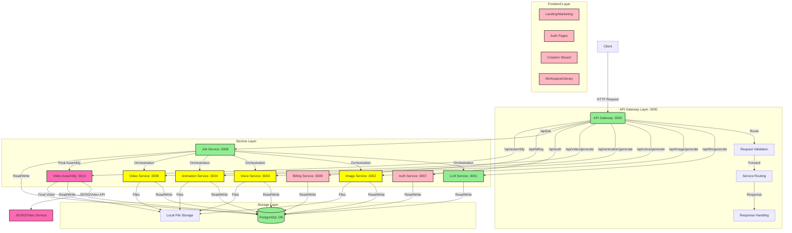

# Comprehensive Architecture Overview - SHORT-VIDEO-CREATOR-SIMPLIFIED

## System Overview

SHORT-VIDEO-CREATOR-SIMPLIFIED is a microservices-based application that automates the creation of short-form videos through AI services integration. The system processes user inputs through a streamlined interface to generate scripts, voice narrations, images, animations, and final videos.

## System Architecture



## Component Specifications

### 1. Frontend Layer

#### Public Pages
- Landing page with service explanation
- Pricing comparison
- Features showcase with mouseover details
- FAQ section
- Use cases showcase
- Authentication pages

#### Protected Pages
- Creation Wizard
  - Basic Mode:
    - Video prompt input
    - Scene count selection (max 6 for free tier)
    - Video length selection (max 30s for free tier)
    - Voice selection
    - Aspect ratio selection
  - Advanced Mode:
    - Script style customization
    - Shot style selection
    - Animation type selection
    - Style value adjustment (0-1000)
- Scene Editor
- Workspace/Library

### 2. API Gateway (Port 3000)
Implementation Status: Complete
- Request routing and validation
- Service coordination
- Error handling
- Health monitoring
- Response formatting

### 3. Service Layer

#### Implemented Services:
1. **LLM Service** (Port 3001)
   - Script generation
   - Scene structuring
   - Full database integration
   - OpenAI integration

2. **Image Service** (Port 3002)
   - Midjourney integration
   - Image generation endpoints
   - Local file storage
   - Metadata management

3. **Voice Service** (Port 3003)
   - ElevenLabs integration
   - Voice synthesis endpoints
   - Local file storage
   - Metadata management

4. **Animation Service** (Port 3004)
   - ImmersityAI integration
   - Animation endpoints
   - Local file storage
   - Metadata management

5. **Video Service** (Port 3006)
   - LumaAI integration
   - Video creation endpoints
   - Local file storage
   - Metadata management

6. **Job Service** (Port 3008)
   - Job orchestration
   - Status tracking
   - Resource management
   - Service coordination

#### New Service:
7. **Video Assembly Service** (Port 3010)
   - JSON2Video API integration
   - Final video compilation
   - Asset management
   - Quality control

#### Planned Services:
8. **Auth Service** (Port 3007)
   - Social login (Google, Apple)
   - Email/password authentication
   - JWT token management
   - Session handling

9. **Billing Service** (Port 3009)
   - Credit system management
   - Premium feature access
   - Transaction tracking
   - Usage monitoring

### 4. Storage Layer

#### Database (PostgreSQL)
Implementation Status: Complete
- Users and authentication
- Content management
- Job tracking
- Service outputs
- Billing and credits

#### File Storage
Implementation Status: Complete (Local)
```plaintext
data/output/
├── llm/
│   └── YYYY-MM-DD/
│       └── [jobId]/
├── image/
│   └── YYYY-MM-DD/
│       └── [jobId]/
├── voice/
│   └── YYYY-MM-DD/
│       └── [jobId]/
├── animation/
│   └── YYYY-MM-DD/
│       └── [jobId]/
├── video/
│   └── YYYY-MM-DD/
│       └── [jobId]/
└── final/
    └── YYYY-MM-DD/
        └── [jobId]/
```


## Data Flow

### 1. Content Creation Flow
1. User submits creation request
2. Job Service creates new job
3. Services execute in parallel per scene:
   - LLM generates script
   - Image Service creates visuals
   - Voice Service generates narration
   - Animation Service processes animations
4. Video Assembly Service compiles final video
5. Result delivered to user

### 2. File Management Flow
1. Services generate content
2. Files stored in local filesystem
3. Metadata stored in database
4. Paths tracked in job records
5. Cleanup handled by Job Service

## Implementation Status

### Complete
- API Gateway
- LLM Service with database
- Service endpoints
- Basic job orchestration
- Local file storage
- Database structure

### In Development
- Video Assembly Service
- JSON2Video integration
- Final video compilation

### Planned
- Frontend application
- Authentication system
- Billing system
- Premium features
- Advanced error handling

## Deployment Strategy
- Development: Local environment
- Testing: Test environment
- Production: Hetzner Cloud
- No containerization currently planned

## Performance Requirements
- Initial capacity: 10 users/hour
- API response time < 200ms
- Job updates < 500ms
- File operations < 1s