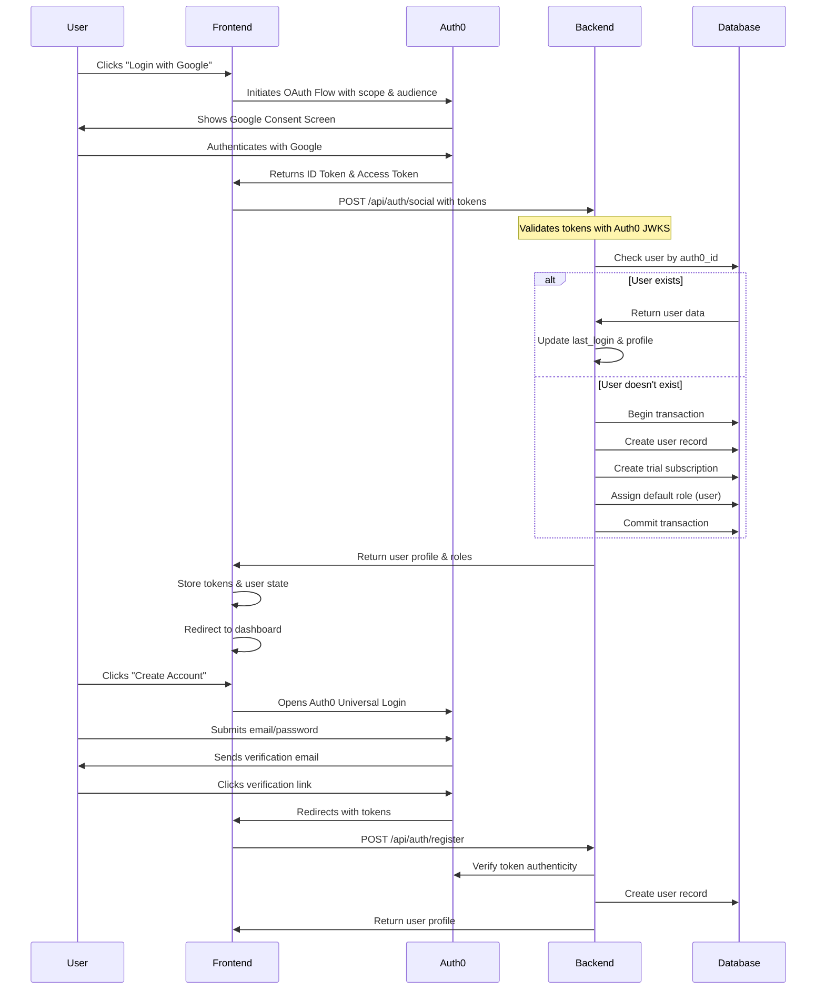

# Authentication Overview

## Registration & Login Flow



## Authentication Methods

1. **Social Authentication**
   - Google OAuth2.0
     - Scopes: email, profile
     - Response type: code
     - PKCE enabled
   - Apple Sign In
     - Services ID configuration
     - Private key authentication
   - Provider Configuration
     ```javascript
     const providerConfig = {
       google: {
         response_type: 'code',
         scope: 'openid profile email',
         prompt: 'select_account'
       },
       apple: {
         response_mode: 'query',
         scope: 'name email'
       }
     };
     ```

2. **Email/Password Authentication**
   - Password Requirements:
     - Minimum 8 characters
     - At least one uppercase
     - At least one number
     - Special characters required
   - Email Verification Flow
   - Password Reset Process
   - Brute Force Protection

3. **Session Management**
   - JWT Structure:
     ```javascript
     {
       "iss": "https://{AUTH0_DOMAIN}/",
       "sub": "auth0|user_id",
       "aud": ["{API_IDENTIFIER}", "https://{AUTH0_DOMAIN}/userinfo"],
       "azp": "{CLIENT_ID}",
       "exp": 1489179954,
       "iat": 1489143954,
       "scope": "openid profile email"
     }
     ```
   - Token Storage:
     - Access token: Memory only
     - Refresh token: HTTP-only cookie
     - ID token: Local storage (optional)
   - Refresh Logic:
     - Auto refresh 5 minutes before expiry
     - Sliding session implementation
     - Grace period for background tabs

## Security Measures

1. **Token Security**
   - RS256 signature verification
   - Audience validation
   - Issuer validation
   - Expiration checking
   - Scope validation

2. **Request Security**
   - CSRF protection
   - Rate limiting
   - Request origin validation
   - XSS prevention headers

3. **Error Handling**
   - Generic error messages
   - Detailed server logs
   - Security event monitoring
   - Failed login tracking

## Architecture Decision
We've chosen a backend-centric Auth0 integration for enhanced security and flexibility.

### Key Benefits
- Server-side token validation
- Centralized auth logic
- Better security control
- Easier provider switching if needed

## Flow Overview
1. User initiates login (frontend)
2. Auth0 handles authentication
3. Backend validates tokens
4. Session management via backend
5. Frontend receives auth status

## Components
- Backend Auth Middleware
- API Authentication
- Frontend Auth Client
- Protected Routes 