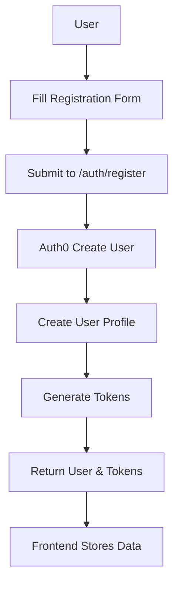
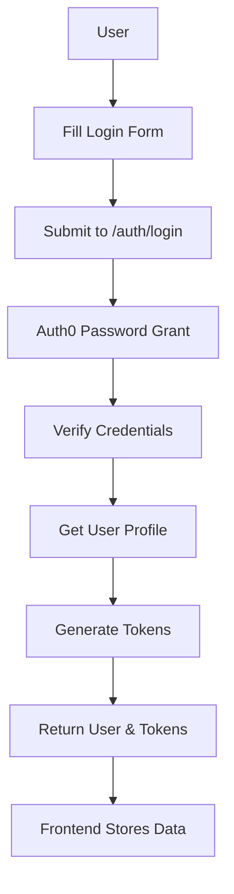
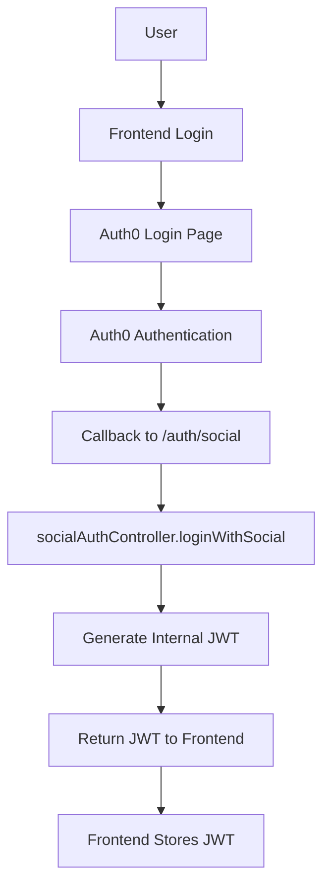
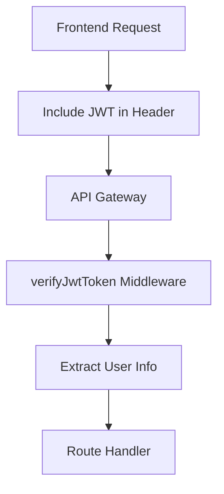

# Authentication Flow

## Overview

This document details the end-to-end authentication flows in the Short Video Creator platform, covering user registration, login, and machine-to-machine (M2M) authentication processes.

## User Registration Flow

### 1. Social Registration
```mermaid
graph TD
    A[User] --> B[Click Social Login]
    B --> C[Auth0 Login Page]
    C --> D[Auth0 Social Provider]
    D --> E[Auth0 Callback]
    E --> F[/auth/register-callback]
    F --> G[Create User Profile]
    G --> H[Generate Tokens]
    H --> I[Return User & Tokens]
    I --> J[Frontend Stores Data]
```

1. User clicks social login button
2. Auth0 redirects to social provider
3. Upon successful authentication:
   - Auth0 returns user profile
   - Backend creates user record
   - Tokens are generated and returned
   - Frontend stores tokens and user data

### 2. Email/Password Registration


1. User submits registration form
2. Backend validates input
3. Auth0 creates user account
4. Upon successful creation:
   - Backend creates user profile
   - Tokens are generated
   - Frontend stores data

## User Authentication Flow

### 1. Email/Password Login


1. User submits login form with credentials
2. Backend validates with Auth0
3. Upon successful authentication:
   - User profile is retrieved
   - Tokens are generated
   - Frontend stores data

### 2. Social Authentication


1. User initiates login through the frontend
2. Auth0 handles the authentication process
3. Upon successful authentication:
   - Frontend receives Auth0 token
   - Token is exchanged for our internal JWT
   - JWT is stored in localStorage

### 3. API Request Flow


Each API request:
1. Includes JWT in Authorization header
2. Passes through JWT verification middleware
3. User information is extracted and attached to request
4. Request proceeds to route handler

## M2M Authentication Flow

### 1. Configuration
```typescript
// M2M Application Config in frontend
export const auth0M2MConfig = {
  domain: process.env.NEXT_PUBLIC_AUTH0_DOMAIN,
  clientId: process.env.NEXT_PUBLIC_AUTH0_M2M_CLIENT_ID,
  clientSecret: process.env.NEXT_PUBLIC_AUTH0_M2M_CLIENT_SECRET,
  audience: process.env.NEXT_PUBLIC_AUTH0_AUDIENCE,
};
```

### 2. Token Management
```typescript
// In AuthContext
const getM2MToken = async () => {
  // Check cached token
  if (validCachedToken) {
    return cachedToken;
  }

  // Get new token
  const response = await fetch('/api/auth/token', {
    body: {
      client_id: auth0M2MConfig.clientId,
      client_secret: auth0M2MConfig.clientSecret,
      audience: auth0M2MConfig.audience,
      grant_type: 'client_credentials'
    }
  });

  // Cache token with expiration
  localStorage.setItem(M2M_TOKEN_KEY, token);
  localStorage.setItem(M2M_TOKEN_EXPIRY_KEY, expiry);
};
```

### 3. Protected Endpoints
```javascript
// In backend middleware
const checkPermission = (requiredPermission) => {
  return async (req, res, next) => {
    // For M2M tokens
    if (payload.gty === 'client-credentials') {
      const scopes = payload.scope.split(' ');
      if (!scopes.includes(requiredScope)) {
        return res.status(403).json({
          error: 'Insufficient scope'
        });
      }
    }
    // For user tokens...
  };
};
```

### 4. Service Endpoints
The following endpoints allow M2M access with appropriate scopes:
- `/api/llm` - LLM service endpoints (create:llm)
- `/api/image` - Image generation endpoints (create:images)
- `/api/voice` - Voice synthesis endpoints (create:voice)
- `/api/animation` - Animation generation endpoints (create:animations)
- `/api/video` - Video processing endpoints (create:videos)
- `/api/music` - Music generation endpoints (create:music)
- `/api/assembly` - Assembly service endpoints (create:assembly)
- `/api/job` - Job management endpoints (create:jobs)

## Error Handling

### 1. Registration Errors
```javascript
// 400 Bad Request - Invalid Input
{
  "error": "Validation failed",
  "details": {
    "email": "Invalid email format",
    "password": "Password must be at least 8 characters"
  }
}

// 409 Conflict - User Exists
{
  "error": "User already exists",
  "message": "An account with this email already exists"
}

// 500 Internal Error - Auth0 Error
{
  "error": "Registration failed",
  "message": "Unable to create user account"
}
```

### 2. Login Errors
```javascript
// 401 Unauthorized - Invalid Credentials
{
  "error": "Invalid credentials",
  "message": "Email or password is incorrect"
}

// 403 Forbidden - Account Locked
{
  "error": "Account locked",
  "message": "Too many failed attempts",
  "unlockTime": "2024-01-20T15:00:00Z"
}

// 404 Not Found - User Not Found
{
  "error": "User not found",
  "message": "No account found with this email"
}
```

### 3. Token Errors
```javascript
// 401 Unauthorized
{
  "error": "Invalid token",
  "message": "Authentication required"
}

// 403 Forbidden
{
  "error": "Access denied",
  "message": "Insufficient permissions"
}
```

### 4. Rate Limit Errors
```javascript
// 429 Too Many Requests
{
  "error": "Too many requests",
  "retryAfter": "15 minutes"
}
```

## Security Measures

### 1. Registration Security
- Email verification required
- Password strength validation
- Rate limiting on registration attempts
- Duplicate account prevention
- Social provider email verification

### 2. Login Security
- Progressive delays on failed attempts
- Account locking after multiple failures
- IP-based rate limiting
- Secure credential transmission
- Session invalidation on security events

### 3. Token Storage
- User tokens stored in localStorage
- M2M tokens cached with expiration
- Tokens cleared on logout

### 4. Rate Limiting
```javascript
const m2mTokenLimiter = rateLimit({
  windowMs: 60 * 60 * 1000, // 1 hour
  max: 100 // 100 token requests
});
```

### 5. Scope Verification
```javascript
const requiredScopes = [
  'create:llm',
  'create:images',
  'create:voice',
  // ...
];

const hasRequiredScopes = scopes.every(scope => 
  tokenScopes.includes(scope)
);
```

## Best Practices

1. **Token Management**
   - Store tokens securely
   - Implement token refresh
   - Handle token expiration
   - Clear tokens on logout

2. **Error Handling**
   - Provide clear error messages
   - Implement proper status codes
   - Log authentication failures

3. **Security**
   - Rate limit authentication attempts
   - Validate tokens on each request
   - Implement proper CORS settings

4. **Monitoring**
   - Log authentication events
   - Track failed attempts
   - Monitor token usage

## Implementation Components

### Frontend
1. **AuthContext**
   - Manages authentication state
   - Handles token storage
   - Provides M2M token management

2. **Configuration**
   - Separate SPA and M2M configs
   - Environment-based settings
   - Validation of required fields

### Backend
1. **Middleware**
   - `auth0.js`: Core authentication middleware
   - Token verification
   - Scope checking
   - Rate limiting

2. **Services**
   - Protected API endpoints
   - Service-specific permissions
   - Error handling 